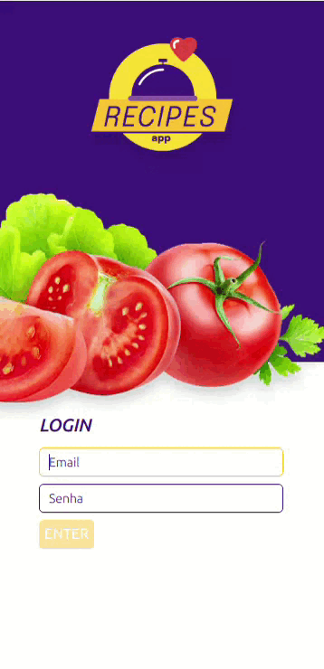

# Projeto Recipes App
Projeto desenvolvido no módulo de Front-End da Trybe, utilizando o que há de mais moderno dentro do ecossistema React e Redux.
No aplicativo é possível ver, buscar, filtrar, favoritar e acompanhar o progresso de preparação de receitas de comidas e bebidas.
O aplicativo possui o layout pensado para dispositivos móveis, em função disso o foi utilizada a resolução 360 x 640 como base para o desenvolvimento.
O projeto foi desenvolvido por um squad de 5 pessoas:
<li><a href="https://github.com/PauloScapol">Paulo Scapol</a></li>
<li><a href="https://github.com/brunagimenez">Bruna Gimenez</a></li>
<li><a href="https://github.com/VicSales28">Victoria Sales</a></li>
<li><a href="https://github.com/VictorDmgs">Victor Alves</a></li>

# Tecnologias Utilizadas
<li>JavaScript</li>
<li>CSS</li>
<li>HTML</li>
<li>React</li>
<li>Redux</li>

# APIs
<li>TheMealDB API</li>
O TheMealDB é um banco de dados aberto, mantido pela comunidade, com receitas e ingredientes de todo o mundo.
<li>The CockTailDB API</li>
Bem similar (inclusive mantida pela mesma entidade) a TheMealDB API, só que focado em bebidas.

# Demonstração da Aplicação

# Como inicializar a aplicação

1.Clone o repositório.
<li><code>git clone git@github.com:LucasSilvaO/recipes-app.git </code></li>
<li><code>Entre no diretório clonado </code></li>

2.Instale as depêndencias:
<li><code>npm install</code></li>

3.Inicialize o projeto:

<li><code>npm start</code></li>